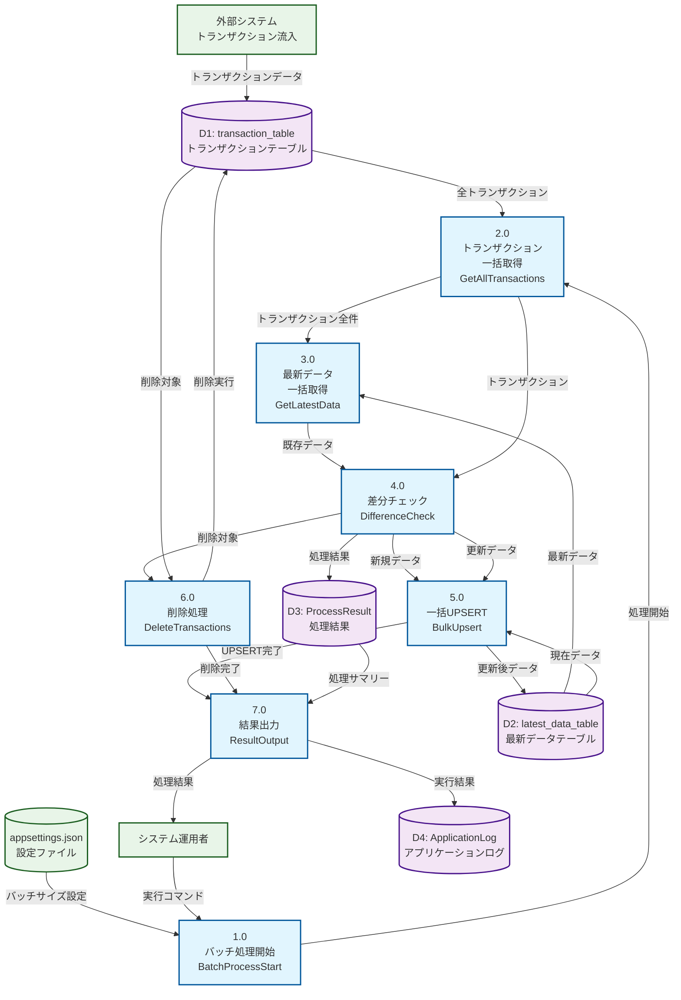

# DFD (Data Flow Diagram) - トランザクション差分チェック・更新システム

## データフロー詳細説明

### レベル0（コンテキスト図）
**システム全体の境界と外部エンティティとの関係**

### レベル1（主要プロセス）

#### 1.0 バッチ処理開始
- **入力**: 実行コマンド、設定ファイル
- **出力**: バッチ処理パラメータ
- **処理**: バッチサイズの決定、ログ初期化

#### 2.0 トランザクション一括取得
- **入力**: バッチ処理開始シグナル
- **出力**: 全トランザクションデータ
- **処理**: `SELECT * FROM transaction_table`

#### 3.0 最新データ一括取得
- **入力**: トランザクションキー
- **出力**: 対応する既存最新データ
- **処理**: 複合主キーでの一括検索

#### 4.0 差分チェック
- **入力**: トランザクションデータ、既存最新データ
- **出力**: 新規/更新/削除対象データ
- **処理**: フィールド単位での差分判定

#### 5.0 一括UPSERT
- **入力**: 新規・更新対象データ
- **出力**: UPSERT結果
- **処理**: PostgreSQL ON CONFLICT構文使用

#### 6.0 削除処理
- **入力**: 削除対象トランザクションキー
- **出力**: 削除件数
- **処理**: 差分なしトランザクションの一括削除

#### 7.0 結果出力
- **入力**: 処理結果、ログデータ
- **出力**: 処理サマリー
- **処理**: 統計情報の集計とログ出力

### データストア詳細

#### D1: transaction_table
- **目的**: 一時的なトランザクションデータ格納
- **特徴**: 毎回トランケート、大量データ流入

#### D2: latest_data_table
- **目的**: 各エンティティの最新状態保持
- **特徴**: 複合主キー、永続化データ

#### D3: ProcessResult
- **目的**: 各処理の詳細結果格納
- **特徴**: メモリ内一時データ

#### D4: ApplicationLog
- **目的**: システム動作ログ
- **特徴**: 日本語ログ、構造化データ
