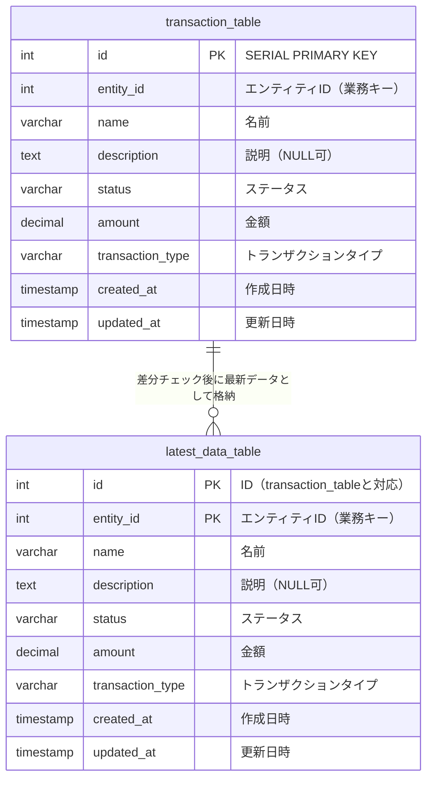

# ER図 (Entity Relationship Diagram)

## 主要な特徴

### 複合主キー設計
- **latest_data_table**: `(id, entity_id)`の複合主キー
- **関係性明確化**: transaction_tableとlatest_data_tableの対応関係を正確に管理

### データフロー
1. **transaction_table**: 大量のトランザクションデータが継続的に流入
2. **差分チェック**: 既存のlatest_data_tableとの比較
3. **UPSERT処理**: 新規登録・更新・スキップの判定
4. **クリーンアップ**: 差分がなかったトランザクションの自動削除

### インデックス最適化
- エンティティID + 作成日時の複合インデックス
- 複合主キーインデックス
- 高速検索のためのエンティティIDインデックス
