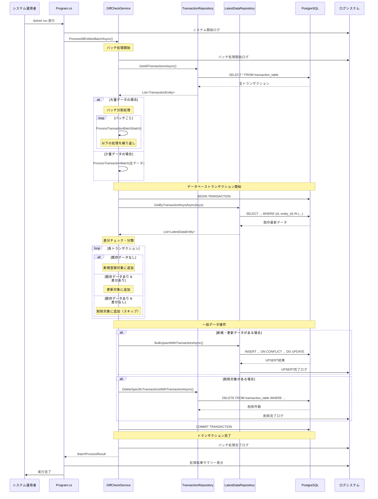
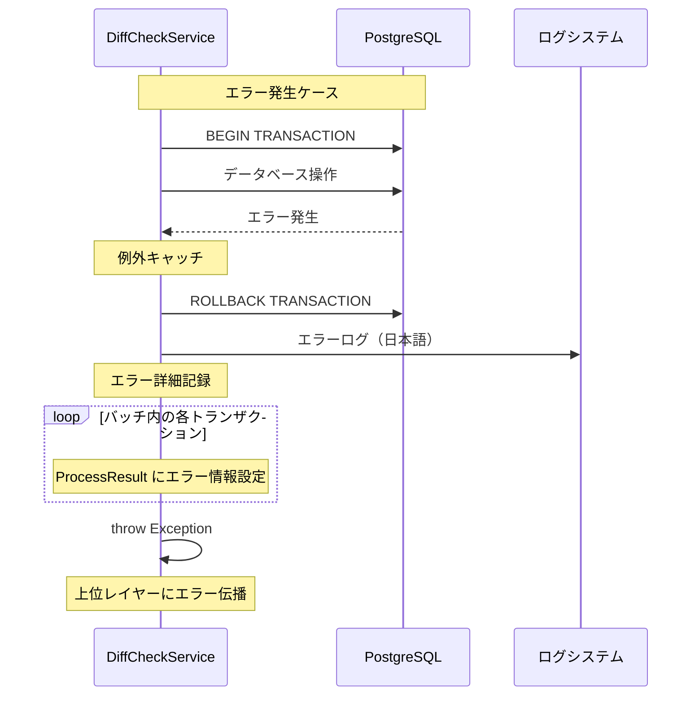
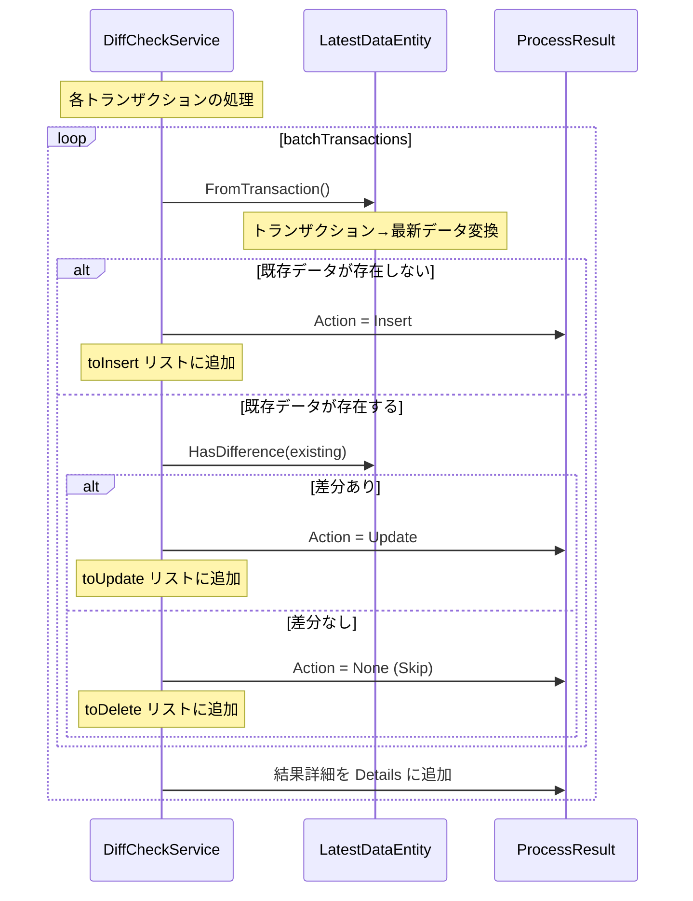
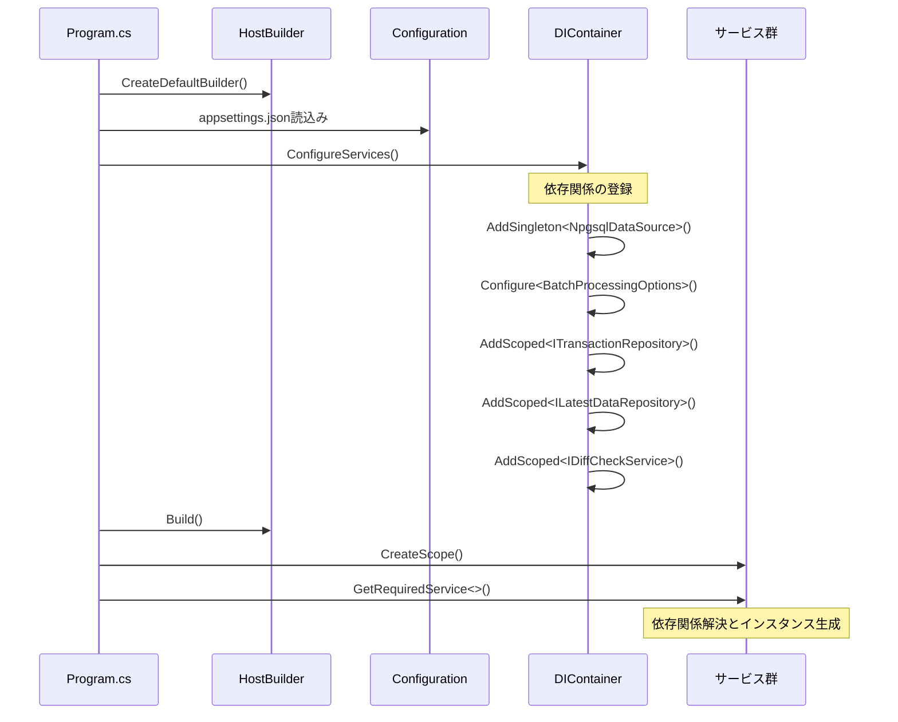
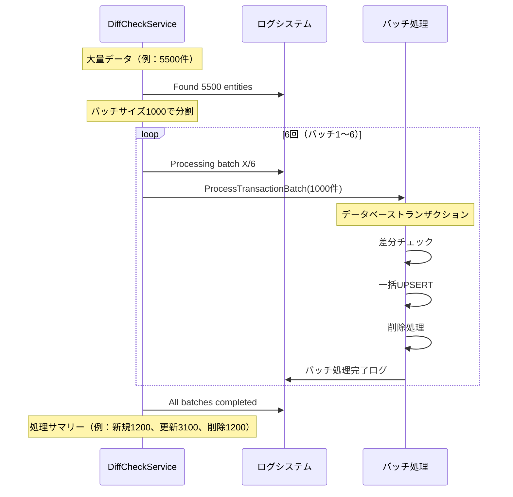

# シーケンス図 (Sequence Diagram) - バッチ処理フロー

## メインシーケンス（正常処理）

## エラー処理シーケンス

## 詳細処理シーケンス（差分チェック部分）

## 設定・依存関係注入シーケンス

## 大量データ処理シーケンス

## 主要な特徴

### トランザクション制御
- **ACID特性保証**: 各バッチ単位でデータベーストランザクション
- **ロールバック機能**: エラー時の確実な状態復旧
- **アトミック操作**: UPSERT + DELETE の一括実行

### エラーハンドリング
- **階層的例外処理**: 個別エラー + バッチエラー + システムエラー
- **日本語ログ**: 全てのログメッセージが日本語で出力
- **詳細追跡**: 各トランザクションの処理結果を記録

### パフォーマンス最適化
- **バッチ分割処理**: 大量データを効率的に処理
- **一括操作**: N+1問題の回避
- **インメモリ差分チェック**: データベースアクセス最小化
