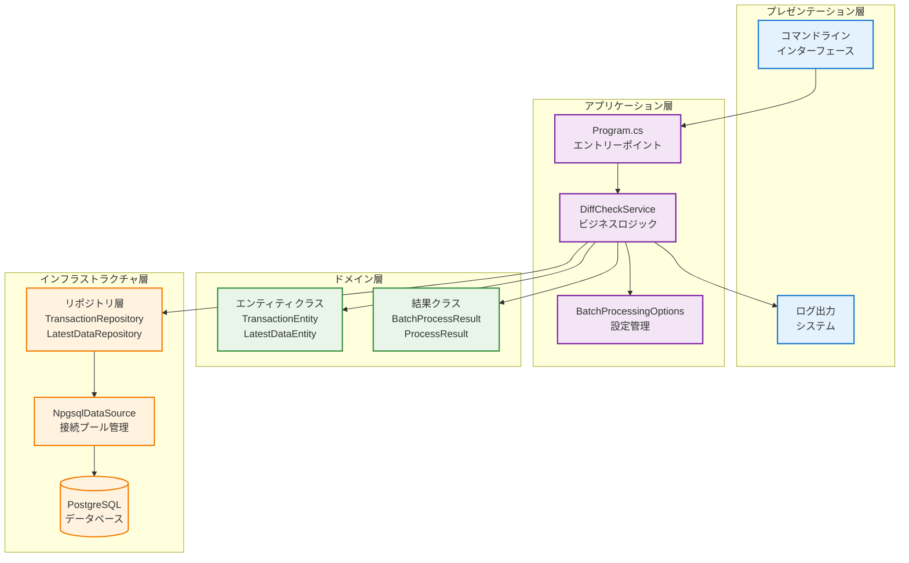

# システム設計図集 - トランザクション差分チェック・更新システム

このドキュメントは、トランザクション差分チェック・更新システムの設計を視覚的に表現したMermaid図集です。

## 📋 目次

1. [ER図（データ構造）](#er図)
2. [DFD（データフロー）](#dfd)  
3. [シーケンス図（処理フロー）](#シーケンス図)
4. [アーキテクチャ概要](#アーキテクチャ概要)

---

## 🗄️ ER図

データベースのエンティティとその関係性を表現した図です。

[詳細なER図](./er-diagram.md)

### 主要なポイント
- **複合主キー設計**: `latest_data_table`は`(id, entity_id)`の複合主キー
- **関係性の明確化**: トランザクションと最新データの1対多関係
- **最適化インデックス**: 高速検索のための適切なインデックス設計

---

## 🔄 DFD

システム内のデータフローを表現した図です。

[詳細なDFD](./dfd-diagram.md)

### 主要なポイント  
- **7つの主要プロセス**: バッチ処理開始から結果出力まで
- **4つのデータストア**: transaction_table, latest_data_table, ProcessResult, ApplicationLog
- **外部エンティティ**: 外部システム、運用者、設定ファイル

---

## 🔄 シーケンス図

システムの処理フローを時系列で表現した図です。

[詳細なシーケンス図](./sequence-diagram.md)

### 主要なポイント
- **メインシーケンス**: 正常処理の流れ
- **エラー処理**: 例外発生時のロールバック処理
- **大量データ処理**: バッチ分割による効率的処理
- **依存関係注入**: システム起動時の初期化フロー

---

## 🏗️ アーキテクチャ概要

### 設計パターン

#### Repository Pattern
- データアクセスの抽象化
- テスタビリティの向上
- データベース実装の隠蔽

#### Dependency Injection
- 疎結合設計の実現
- Microsoft.Extensions.DependencyInjection使用
- 設定ベースの柔軟な構成

#### Options Pattern  
- 型安全な設定管理
- appsettings.jsonとの連携
- バリデーション機能

#### Transaction Pattern
- ACID特性の保証
- データベーストランザクションによる整合性確保
- エラー時の自動ロールバック

## 🔧 技術スタック

### フレームワーク・ライブラリ
- **.NET 8.0**: 最新のクロスプラットフォーム開発環境
- **Npgsql**: PostgreSQL用高性能データアクセスライブラリ  
- **Microsoft.Extensions**: DI・Configuration・Logging統合機能

### データベース
- **PostgreSQL**: エンタープライズグレードのリレーショナルデータベース
- **複合主キー**: データ関係性の明確化
- **ROW構文**: 効率的な複合主キー検索
- **ON CONFLICT**: 高速なUPSERT処理

### 運用・監視
- **構造化ログ**: パラメータ付き日本語ログメッセージ
- **パフォーマンス監視**: 処理時間・件数の詳細追跡
- **エラー分離**: 階層的例外処理による堅牢性

## 📊 処理性能指標

### バッチ処理能力
- **小規模データ**: 〜1,000件 → 単一バッチ処理
- **大規模データ**: 1,000件超 → 分割バッチ処理  
- **処理効率**: N+1問題の回避により高速処理を実現

### データベース操作
- **一括取得**: 複合主キーによる効率的検索
- **一括UPSERT**: PostgreSQLの最適化機能活用
- **一括削除**: ROW構文による高速削除処理

### メモリ使用量
- **インメモリ差分チェック**: データベースアクセス最小化
- **バッチサイズ制御**: メモリ使用量の動的調整
- **ストリーミング対応**: 将来の大容量データ対応準備済み

---

## 🚀 今後の拡張計画

### 水平スケーリング
- 分散処理対応
- 複数インスタンスでの並列処理
- ロードバランシング機能

### 監視・運用強化  
- メトリクス収集機能
- リアルタイム監視ダッシュボード
- アラート機能の充実

### 他システム連携
- REST API提供
- メッセージキュー連携
- イベント駆動アーキテクチャ対応
